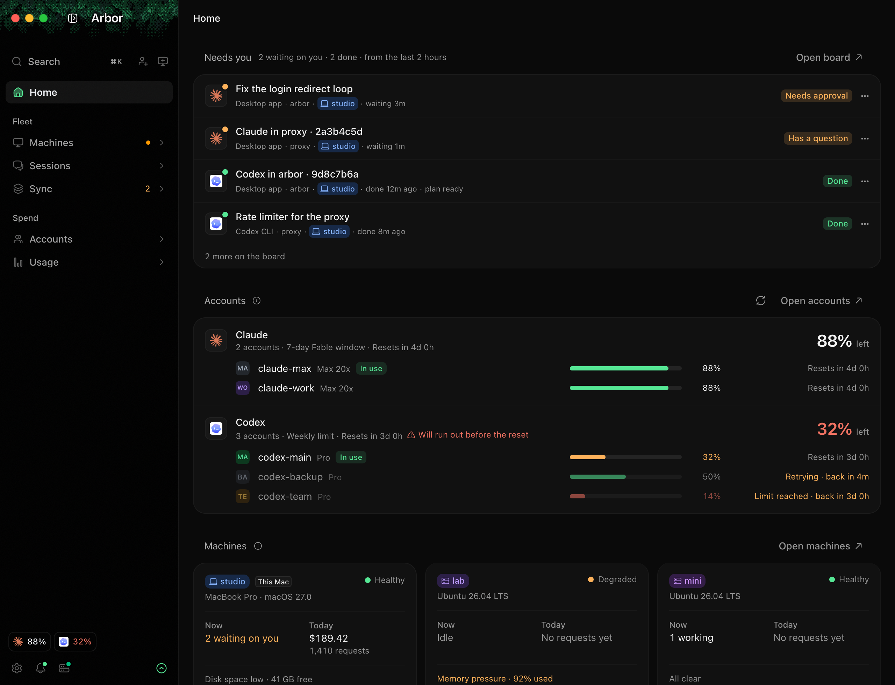
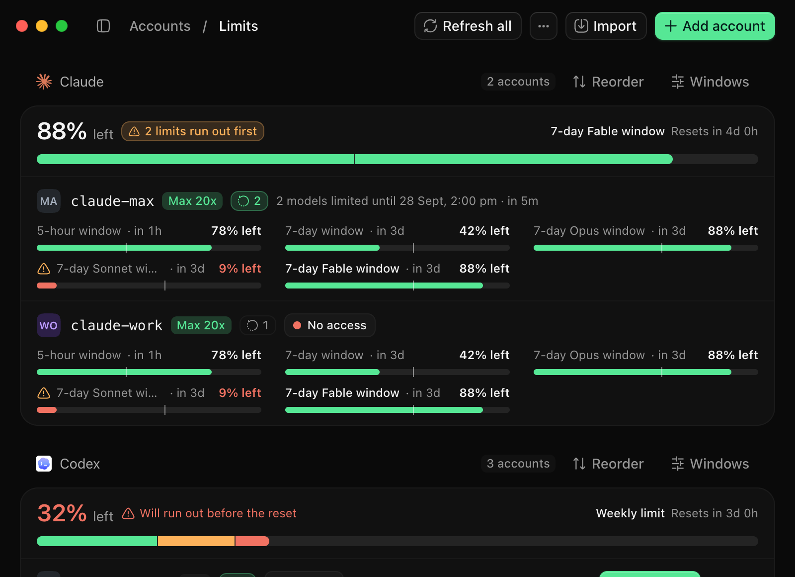
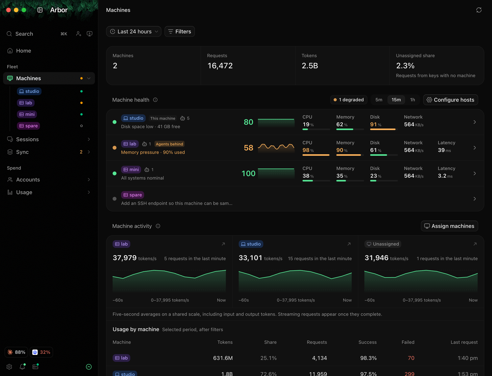
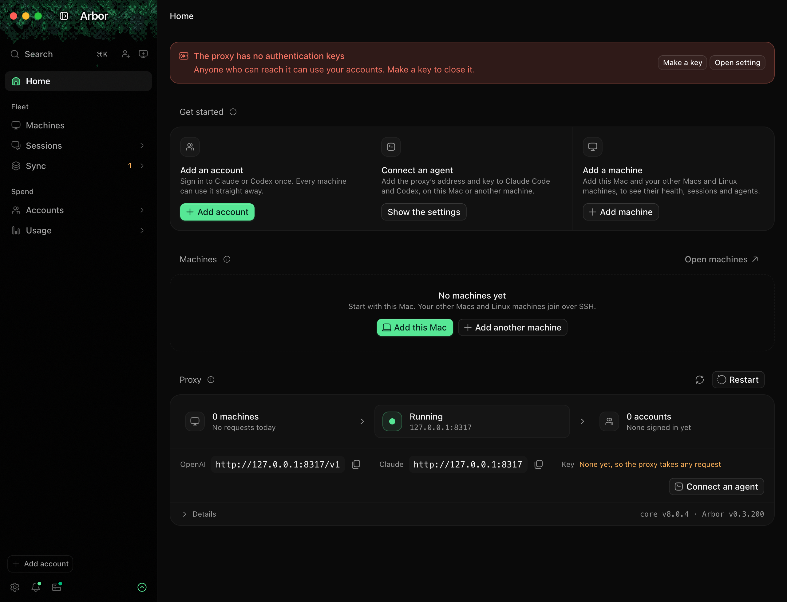

<p align="center">
  
</p>

<p align="center">
  A Mac app that pools your Claude and Codex subscriptions behind one proxy and shares them with every machine you own.<br>
  <a href="https://arbor.onl">arbor.onl</a>
</p>

<p align="center">
  
</p>

Arbor runs [CLIProxyAPI](https://github.com/router-for-me/CLIProxyAPI) ("the core") on your Mac, signs your Claude,
ChatGPT and xAI accounts in to it, and keeps track of their limits. Claude Code and Codex on your Macs and Linux
machines send their requests to the proxy, which passes each one to an account with room left. Arbor doesn't run
your agents; whatever starts them keeps working as it did.

It's for your own accounts on your own machines. It isn't built for sharing accounts with other people.

## What it does

<p align="center">
  
</p>

- **Accounts.** Every account's limits, added up per provider, with when each resets. The proxy moves to the next
  account when one hits its limit, and an account can be paused at a cap you set.
- **Machines.** A page for each machine, checked over SSH: CPU, memory, disk, network, latency, and which Claude Code
  and Codex versions it runs.
- **Sessions.** One live list of Claude Code and Codex sessions on all your machines, with an alert on your Mac or phone
  when one needs you.
- **Usage.** Every request's machine, client, model and tokens, priced at API rates and added up per account, session,
  project and week.
- **Sync.** CLAUDE.md, AGENTS.md, skills, MCP servers, plugins and settings compared across machines and kept in step
  from a git repository, with every change shown first, backed up, and undoable.
- **Session archive.** Every transcript from every machine, copied to a drive you choose.

<p align="center">
  
</p>

## Download

Signed downloads for macOS are coming soon. Until then, build it from source (below).

## First run

Home's Get started card takes you through it:

<p align="center">
  
</p>

1. **Add an account.** Sign in to each Claude, ChatGPT or other provider account once, in your browser. The sign-in
   stays on this Mac.
2. **Make a key.** A new install's proxy has no key, so it takes any request that reaches it. It listens only on this
   Mac until you change that in Settings › Proxy, and the warning on Home makes a key in one press.
3. **Connect an agent.** Arbor shows the lines to add to Claude Code's and Codex's settings, on this Mac or another
   machine. It doesn't edit those files for you.
4. **Add a machine.** This Mac is offered first. Other Macs and Linux machines are reached over SSH: Arbor lists the
   hosts in your `~/.ssh` config and known hosts, and never reads keys.

Settings › Agent homes lists where each machine's agents keep their files: `~/.claude`, `~/.codex` and Pi's sessions
as standard, plus any other homes a scan finds or you add.

## Build from source

You need macOS on Apple silicon, [Bun](https://bun.sh), Rust (stable) and the Xcode command-line tools.

```sh
bun install --frozen-lockfile
bun tauri dev                      # run the app
bun tauri build --bundles app      # build Arbor.app into src-tauri/target/release/bundle/macos/
```

`bun install` prints a 401 for `@hugeicons-pro/core-duotone-rounded`. That's expected: it's an optional,
commercially licensed icon set that only official builds include. Without it the free Hugeicons set is used.

A development build keeps its data in `src-tauri/target/debug`, away from an installed Arbor's. The app itself keeps
its config, sign-ins and usage history in `~/Library/Application Support/onl.arbor.app`.

### The browser mock

`src/dev/mockTauri.ts` answers every command and core API call the interface makes, so the whole app runs in a normal
browser without the core or any accounts:

```sh
bunx vite --host 127.0.0.1 --port 1420 --strictPort   # then open http://127.0.0.1:1420
```

The comment at the top of `mockTauri.ts` lists its scenario flags: `?fresh=1` for a new install with nothing set up,
`?usagedata=new`, `?limit=claude`, and more.

### Checks

```sh
bun run verify        # typecheck, test typecheck, oxlint, knip and bun test
bun run verify:rust   # cargo test for the app and the core plugin
bun run notices       # regenerate THIRD_PARTY_NOTICES.md after changing dependencies
```

`AGENTS.md` describes the code's layout, conventions and safety rules; read it before changing anything.

## Usage data

Official releases send anonymous usage data (which pages are opened) and crash reports to PostHog, with a random id
for the install. They never send account, machine or project names, paths, or anything from your sessions. The first
launch says so, and both can be turned off in Settings › App; `DO_NOT_TRACK=1` or `ARBOR_TELEMETRY=0` turns them
off too. A build from source sends nothing: the project key is only built into official releases.

## Privacy

- Sign-ins stay on the Mac that runs Arbor. Other machines get the proxy's address and a key.
- Arbor reads session ids, times, models and token counts, never prompts or replies. Only the session archive copies
  whole transcripts, to a drive you choose.

## Releases

Nightlies, `X.Y.Z-nightly.YYYYMMDD.N`, are built from main when it changes, at most every six hours, and published as
prereleases; Settings › Updates moves an install to them. A stable release, `arbor-vX.Y.Z`, promotes a nightly that's
already out, so it's always a build nightly installs have run. GitHub Actions builds both
(`.github/workflows/arbor-release.yml`) with `scripts/build-release.sh`. Each carries a DMG and an update list signed with Ed25519 (`src-tauri/release-signing.pub`);
the app only installs what that list names. Release notes are kept in `release-notes.json`.

## Layout

```
src/                 React app
  components/        shared components; ui/ holds the primitives
  pages/             one file per page; SettingsPages.tsx routes the Settings area
  services/          pure logic and stores
  i18n/locales/en.ts every user-facing string
  dev/               the browser mock
src-tauri/           Rust: the core's lifecycle, the management API, usage, machines, sessions, sync, updates
core-plugins/        arbor-models, a plugin for the core behind Settings › Extra models
tests/               bun:test suites
scripts/             releases, release notes, notices
```

## License and credits

Arbor is released under the [MIT License](LICENSE). It's a fork of
[EasyCLIProxyAPI](https://github.com/router-for-me/EasyCLIProxyAPI) and runs
[CLIProxyAPI](https://github.com/router-for-me/CLIProxyAPI), both by Router-For.ME. Its UI components are adapted from
[T3 Code](https://github.com/pingdotgg/t3code) and [coss ui](https://github.com/cosscom/coss), its icons are
[Hugeicons](https://hugeicons.com) and its provider logos come from [Lobe Icons](https://github.com/lobehub/lobe-icons).
Settings › About lists every project Arbor draws on, and [THIRD_PARTY_NOTICES.md](THIRD_PARTY_NOTICES.md) has the
license of every package and crate it includes.

Claude, Codex, ChatGPT, Gemini, Grok, Kimi and the other provider names and logos are trademarks of their owners.
Arbor isn't affiliated with or endorsed by any of them.
